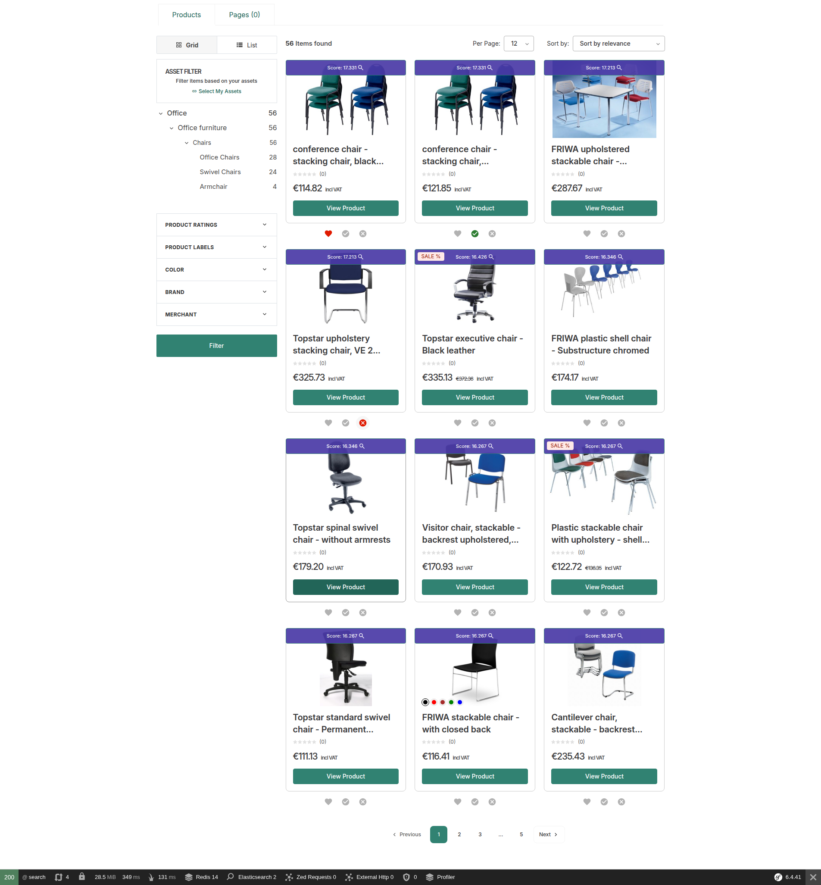
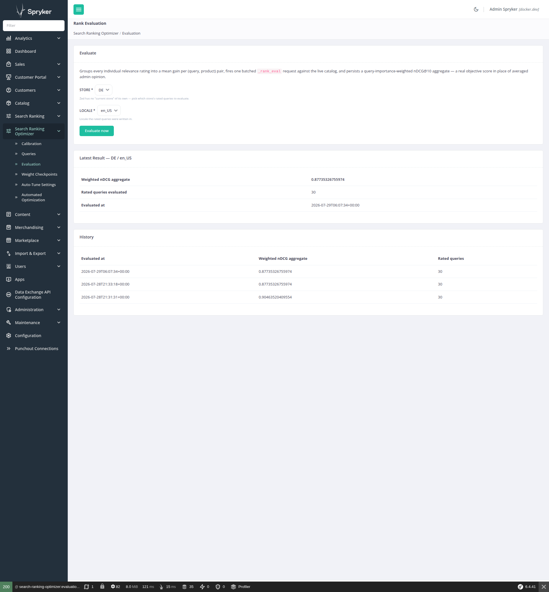
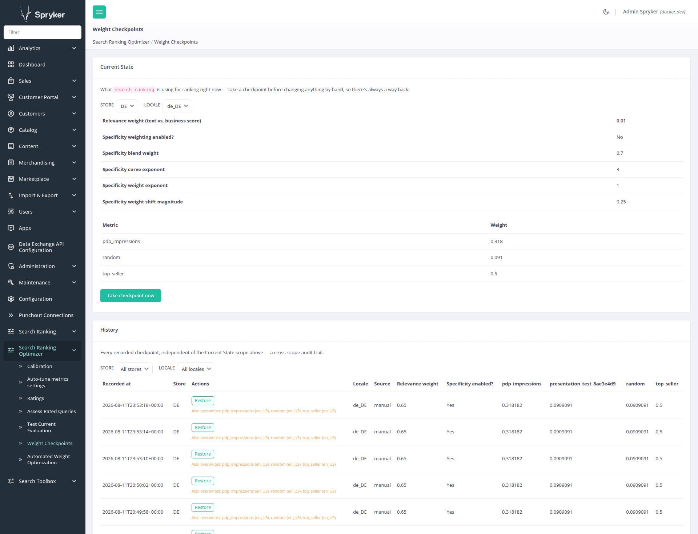
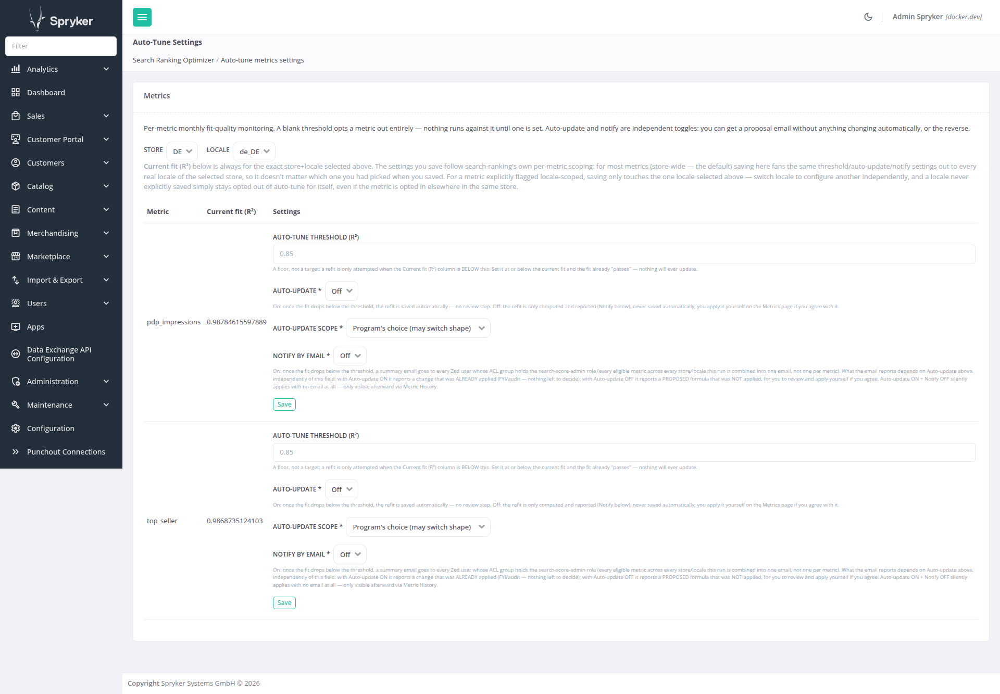
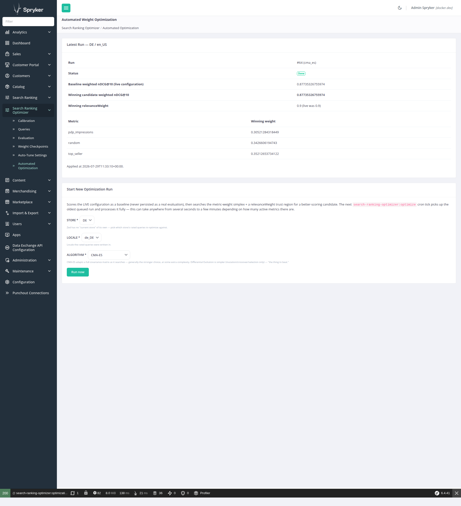

# Spryker Search Ranking Optimizer

Deciding *what* the ranking weights and parameters should be, on top of
[spryker-community/search-ranking](https://github.com/andrebarthelmeshellmuth/spryker-search-ranking),
which provides the mechanism to *use* them (business-signal metrics, formulas, `function_score` ranking,
manual weight/parameter editing).

This package is a real, one-directional dependent of `search-ranking`: it reads and writes that package's
tuning parameters through that package's own facade. `search-ranking` has no knowledge of this package and
installs and runs completely standalone without it (see [Relationship to search-ranking](#relationship-to-search-ranking)).

## Contents

- [Terminology](#terminology)
- [Status](#status)
- [What it does today](#what-it-does-today)
  - [Calibration — empirically sampling `relevanceSaturationPoint` (k)](#calibration--empirically-sampling-relevancesaturationpoint-k)
  - [SRP relevance rating — capturing real (query, product) judgments](#srp-relevance-rating--capturing-real-query-product-judgments)
  - [Rank evaluation — a real objective score, not averaged opinion](#rank-evaluation--a-real-objective-score-not-averaged-opinion)
  - [Weight checkpoints — a way back before changing anything by hand](#weight-checkpoints--a-way-back-before-changing-anything-by-hand)
  - [Auto-tune — a monthly fit-quality check per metric](#auto-tune--a-monthly-fit-quality-check-per-metric)
  - [Automated weight optimization — searching relevanceWeight and metric weights algorithmically](#automated-weight-optimization--searching-relevanceweight-and-metric-weights-algorithmically)
- [Relationship to search-ranking](#relationship-to-search-ranking)
- [Requirements](#requirements)
- [Installation](#installation)
  - [1. Install the package](#1-install-the-package)
  - [2. Register the core namespace](#2-register-the-core-namespace)
  - [3. Register the console command](#3-register-the-console-command)
  - [3a. Register the permission plugins (required for the SRP rating widget)](#3a-register-the-permission-plugins-required-for-the-srp-rating-widget)
  - [3b. Register the Yves widget plugins](#3b-register-the-yves-widget-plugins)
  - [4. Register the Zed navigation entry](#4-register-the-zed-navigation-entry)
  - [5. Translations](#5-translations)
  - [6. Build (transfers, Propel tables, caches)](#6-build-transfers-propel-tables-caches)
  - [7. Schedule the calibration, auto-tune, and optimize crons](#7-schedule-the-calibration-auto-tune-and-optimize-crons)
- [Modules](#modules)
- [Roadmap](#roadmap)
- [Limitations](#limitations)
- [Testing and CI](#testing-and-ci)
  - [Automated checks](#automated-checks)
  - [Test suite](#test-suite)
  - [Opt-in ground-truth suite (not part of the default test run)](#opt-in-ground-truth-suite-not-part-of-the-default-test-run)
- [License](#license)
- [Acknowledgements](#acknowledgements)

## Terminology

A quick reference for terms this README reuses across many sections — a lookup index, not a replacement
for the fuller explanation given where each is first introduced in context. `search-ranking`'s own README
has its own [Terminology](https://github.com/andrebarthelmeshellmuth/spryker-search-ranking#terminology)
section for the terms it owns (metric, weight, relevanceWeight, relevanceSaturationPoint, digest, signal,
raw/normalized value) — not repeated here.

### rating / judgment

A customer's heart/check/X click on one product for one search term, captured by the SRP widget. The raw
material every other piece in this README is built on top of. See
[SRP relevance rating](#srp-relevance-rating--capturing-real-query-product-judgments).

### query (rated query)

One distinct (search term, store, locale) triple that has accumulated at least one rating —
`spy_search_ranking_query`'s own row, with an editable `importanceWeight` curators can use to make some
queries count more than others in the aggregate rank_eval score. See
[SRP relevance rating](#srp-relevance-rating--capturing-real-query-product-judgments).

### rank_eval score

The single number Elasticsearch/OpenSearch's `_rank_eval` API returns for a set of rated queries against a
given ranking configuration — an nDCG-style, importance-weighted aggregate. The objective function every
other piece here (calibration excluded) is ultimately trying to move. See
[Rank evaluation](#rank-evaluation--a-real-objective-score-not-averaged-opinion).

### weight checkpoint

A snapshot of every tunable weight (`relevanceWeight` + every metric weight) taken automatically before an
apply action changes them — the "undo" a human or an automated run can restore. See
[Weight checkpoints](#weight-checkpoints--a-way-back-before-changing-anything-by-hand).

### z-space / softmax reparametrization

The unconstrained real-valued vector an optimization algorithm actually searches in, and the transform
(`SimplexSoftmaxReparametrization`) that converts it to and from a valid, sum-to-one set of metric weights.
Never surfaced in the GUI — an implementation detail of
[automated weight optimization](#automated-weight-optimization--searching-relevanceweight-and-metric-weights-algorithmically).

### trust region

The bounded neighborhood around the live `relevanceWeight` (`±0.15` by default) an optimization run is
allowed to search within, so one run can't propose a wildly untested value in a single shot. See
[automated weight optimization](#automated-weight-optimization--searching-relevanceweight-and-metric-weights-algorithmically).

## Status

**Calibration, the SRP relevance-rating widget, the Zed Queries curation page, offline `rank_eval`
evaluation, weight checkpoint/rollback, the monthly auto-tune job, and automated weight optimization
(CMA-ES/differential evolution against the rank-evaluation score, including `search-ranking`'s
entropy-aware relevance weighting knobs) are all built, tested, and shipping.**
The rest of the tuning layer (an SRP weight-slider live preview) is designed and on the
[Roadmap](#roadmap) but not built yet.

Verified live end-to-end in a real browser (not just the automated test suite — see
[Testing and CI](#testing-and-ci) for why that alone wouldn't have been enough): a customer clicks a rating
button on the storefront, the judgment round-trips through the Yves→Zed gateway with a server-side
permission re-check, and lands correctly in the database.



## What it does today

### Calibration — empirically sampling `relevanceSaturationPoint` (k)

`search-ranking` blends text relevance with business signals using a saturating transform of the raw
Elasticsearch/OpenSearch `_score`: `_score / (_score + k)`, where `k` (`relevanceSaturationPoint`) is the
score at which text relevance contributes exactly 0.5. That constant has no universal correct value — it
depends entirely on a shop's own field boosts and typical query shapes, and `search-ranking`'s README is
explicit that it should be **sampled from real `_score` values, not guessed**. Calibration is the tool that
does that sampling.


The workflow, all from the **Search Ranking Optimizer → Calibration** Zed page:

1. **Start a run.** Pick the store and locale to run against (Zed has no implicit current store, so both
   are picked explicitly) and the number of top results per term to sample (X). By default, search terms
   come from the distinct queries already organically rated via the SRP widget below for that store/locale
   — no upload needed. Check **"Bootstrap from CSV upload instead"** to bypass those and provide a CSV
   (one term per line) instead — useful to bootstrap calibration before real ratings exist, or for testing.
   Either way, the run is persisted in status `uploaded`.
2. **Calculate.** The `search-ranking-optimizer:calibrate` console command (run on a cron, or by hand)
   picks up the newest `uploaded` run, marks any older uploaded runs `skipped`, fires the **live catalog
   search-string query** for each term against the real search index, pools the top-X raw text-relevance
   `_score` values across all terms, and computes a suggested `k` from that pool. The run moves to
   `calculated` (or `failed`, with a stored error message). While it's running, the Calibration page shows
   a live "X / Y search terms processed" counter (a small `progressAction()` JSON endpoint the page polls
   once a second) — no fake/indeterminate spinner, since the console command's own per-term loop is a
   genuinely trackable count.
3. **Apply.** Back on the Calibration page, review the suggested `k` against the current live value and
   click **Apply** to write it into `search-ranking`'s `relevanceSaturationPoint` setting — through
   `search-ranking`'s own facade, which republishes the ranking configuration exactly as a manual edit on
   its Settings page would. Applying is a deliberate, separate step: calibration *suggests*, a human
   *decides*.

The console prints, e.g.:

```
Calibration #7 done: sampled 214 score(s) across 12 search term(s), computed k = 6.4180.
```

Firing the query from Zed reuses `search-ranking`'s solved raw-Elastica bypass pattern (the standard
`Client\Search` stack assumes a Yves request context that doesn't exist in a console/Zed process), shipped
here as the `Client\SearchRankingOptimizer\Search` component.

### SRP relevance rating — capturing real (query, product) judgments

Calibration answers "what should `relevanceSaturationPoint` be" from a *sample* of search terms. Longer
term, tuning any part of the ranking formula needs a real, organically-grown judgment set — actual people
saying "this product was/wasn't a good result for this query." The rating widget is how that judgment set
gets built, one click at a time, directly on the storefront search results page (SRP).

- **Heart / check / X buttons** render below every product tile on the SRP, for any customer holding the
  **Relevance Rater** permission (`RateSearchRelevancePermissionPlugin`) — heart = highly relevant, check =
  acceptably relevant, X = not relevant. Default grey, colorized on click (heart/X share a red-family
  accent, check is green); only one button is ever pressed per (customer, product) pair on a given SRP.
  Clicking the already-pressed button unselects it, deleting the underlying rating row — the one case
  where a click means "remove my judgment" rather than "set it."
- **One row per (query, customer, product).** The canonical search term (trimmed, lowercased,
  whitespace-collapsed — deliberately *not* tokenized, so two genuinely different queries never get merged)
  is stored once in `spy_search_ranking_query`; each rating is its own row in
  `spy_search_ranking_query_rating`, unique on `(query, customer_reference, product_abstract)`. The same
  customer re-rating the same pair upserts in place; **different customers rating the same (query, product)
  each keep their own row** — disagreement between raters is a signal to preserve, not average away at
  write time. A brand-new search term is a genuine find-or-create race the moment two raters rate it within
  the same instant: the DB's own unique `(search_term, store_name, locale_name)` constraint lets exactly one
  insert win, and the loser recovers by re-fetching the winner's row rather than losing that rater's
  judgment entirely.
- **`importance_weight`** on `spy_search_ranking_query` (default `1`) lets a **Query Curator** mark some
  queries as mattering more than others once they've accumulated ratings — a deliberately separate skill
  from rating relevance itself. Edited from the **Search Ranking Optimizer → Queries** Zed page: every
  rated query, newest-activity-first, with an "Edit importance" action per row (a plain,
  paginated/sortable/searchable `Gui` table — the same component `spryker-community/search-ranking`'s own
  Metrics page uses). Gated by standard Zed ACL only — a Zed backoffice action, not the customer-facing
  Permission system the widget below uses, so there's no separate fine-grained permission to register for
  it, just the usual ACL group access every other Zed page in this package needs.
- **Server-side authorization, not just a hidden button.** The Yves widget only *renders* for a permitted
  customer, but the write itself goes through a Zed `GatewayController` that independently re-checks the
  permission via the customer's active `CompanyUser` (never trusts the Yves-side check alone) before
  persisting anything.
- **Rejects fabricated (query, product) pairs.** Before persisting a submitted judgment,
  `ProductRelevanceJudgmentWriter` re-runs the same live catalog search Calibration/rank_eval use
  (`ProductSearchMatchVerifier`, narrowed to the one candidate document) and confirms the product is
  actually among the *current* real search results for that term — a request claiming an unrelated product
  matched some search term is rejected outright, never silently trusted from the client.

This is also Calibration's default search-term source (see above) — accumulated ratings feed straight into
the next calibration run with no export/import step. The ratings are also the direct input to rank_eval
evaluation, below.

### Rank evaluation — a real objective score, not averaged opinion

Phases like a weight-slider preview or a propose/review/apply workflow can't answer "did that change make
search better?" without something to measure against. Rank evaluation turns the ratings the widget above
already collects into a real nDCG (Normalized Discounted Cumulative Gain) score via OpenSearch/
Elasticsearch's `_rank_eval` API — a genuine information-retrieval metric, not human opinion averaged
together.



The workflow, from the **Search Ranking Optimizer → Evaluation** Zed page:

1. **Pick a store and locale** and click **Evaluate now**. Unlike Calibration's upload-then-cron-then-poll
   flow, `_rank_eval` fires as a single batched HTTP request covering every rated query at once — fast
   enough to run synchronously, so there's no progress counter or polling needed here.
2. Every individual rating for that store/locale is grouped into a mean gain per (query, product) pair
   (heart/check/x → a configurable numeric gain, default 3/1/0 —
   `SearchRankingOptimizerConfig::getRelevanceJudgmentGainMap()`; a query rated by multiple admins is
   averaged, never overwritten, the same disagreement-preserving design the rating widget itself uses).
3. One `_rank_eval` request per query is built from the exact same live catalog query Calibration fires
   (shared via `LiveCatalogSearchQueryBuilder`), paired with that query's rated products as judgments.
   `metric.dcg.normalize=true` computes nDCG@10 (cutoff configurable —
   `SearchRankingOptimizerConfig::getRankEvalCutoff()`).
4. A **query-importance-weighted aggregate** is computed in PHP from each query's own nDCG score — rank_eval's
   own top-level `metric_score` is a plain *unweighted* mean across queries, confirmed unusable directly.
   The result is persisted (score, query count, timestamp) and the page shows both the latest run and a
   short history, so the score can be tracked over time as ratings accumulate.

```
Evaluated 12 rated queries: weighted nDCG@10 = 0.7123.
```

Firing the query and the `_rank_eval` call both reuse the same raw-Elastica bypass pattern Calibration
established (`Client\SearchRankingOptimizer\Search` component), verified live against this shop's real
OpenSearch index and real catalog products.

### Weight checkpoints — a way back before changing anything by hand

Every tuning knob this package will eventually set automatically (weight-slider preview, propose/review/
apply, auto-tune) is still, today, something an admin edits directly on `search-ranking`'s own Settings
page. A checkpoint is a point-in-time snapshot of every one of those knobs, so a manual edit — or a future
automated one — is always reversible.



From the **Search Ranking Optimizer → Weight Checkpoints** Zed page:

1. **Current State** shows exactly what `search-ranking` is using right now, read live off its own facade:
   `relevanceWeight`, every metric's own weight, the 3 entropy-weighting knobs (probe result size, weight
   exponent, weight shift magnitude), and whether entropy weighting is currently enabled at the code level.
   Deliberately excluded: `relevanceSaturationPoint` (k), which already has its own versioning story via
   Calibration and stays out of checkpoint scope.
2. **Take checkpoint now** persists that current state as a new row — a manual snapshot, before hand-editing
   anything.
3. **History** lists every checkpoint newest-first, each with a **Restore** button. Restoring writes that
   checkpoint's `relevanceWeight`, metric weights, and 3 entropy knobs back through `search-ranking`'s own
   facade (a metric that no longer exists is skipped silently — a safe, best-effort restore, not an
   all-or-nothing transaction), then immediately records the resulting state as a **new** checkpoint of its
   own. Restoring IS applying, not a special "undo" mechanism — there is always a way back from a restore
   too.

`isEntropyWeightingEnabled` is captured on every checkpoint for historical transparency but is **never**
written back by a restore — it is a pure code-level project flag (`Pyz\Shared\SearchRanking\SearchRankingConfig::isEntropyWeightingEnabled()`
in a host shop), with no corresponding save method on `search-ranking`'s facade, deliberately out of scope
for anything database-driven.

### Auto-tune — a monthly fit-quality check per metric

Weight checkpoints above cover `relevanceWeight`/metric weights/entropy knobs — but a metric's own
normalization **formula** (does `pdp_impressions` still fit an `atan` curve, or has the underlying data
drifted enough that a different shape now fits better?) is a completely separate axis, with its own
audit trail already built into `search-ranking` itself (`spy_search_ranking_metric_history`, see that
package's own README). Auto-tune is the monthly job that watches that axis and, per metric, proposes or
applies a refit once the fit degrades — it never touches `relevanceWeight`, metric weight, or the entropy
knobs, so it has no reason to write a weight checkpoint of its own.



From the **Search Ranking Optimizer → Auto-Tune Settings** Zed page, per active metric:

- **Auto-tune threshold (R²)** — left blank by default, meaning the metric is opted OUT of auto-tune
  entirely. Setting a value opts it in: the monthly job compares the metric's CURRENT fit (evaluated
  fresh every run, no side effect) against this floor.
- **Auto-update** (on/off) and **notify by email** (on/off) are independent toggles — all four
  combinations are meaningful: neither (log only, via an `isChange=false` row in `search-ranking`'s own
  history table), auto-update only (silent refit — a bit of a leap of faith, but supported), notify only
  (a proposal email, formula left untouched until a human applies it via `search-ranking`'s own Edit
  page), or both (refit applied AND a summary email sent).
- **Auto-update scope**, once auto-update is on: **"Keep current shape (parameters only)"** re-fits only
  the metric's own current curve family's parameter (e.g. keep `atan`, just recompute its `k`); **"Program's
  choice (may switch shape)"** takes the overall best-fitting candidate across every shape
  `search-ranking`'s own curve fitter offers, even if that means switching families entirely. A metric
  with no known `shape` yet (a freeform/custom formula) always gets program's-choice behavior regardless
  of this setting — there's no "current shape" to stay within.

Running `vendor/bin/console search-ranking-optimizer:auto-tune` (intended for the monthly cron, see
[Installation](#installation)):

```
pdp_impressions: fit still adequate (R² = 0.9883), no change.
random: fit dropped to R² = -1.0634 (below threshold) — skipped, no refit: formula is non-deterministic.
Notified 0 admin(s) by email.
```

A metric whose formula calls a non-deterministic function (`random()` is the one that ships in
`search-ranking`'s own formula DSL today — see
[Automated weight optimization](#automated-weight-optimization--searching-relevanceweight-and-metric-weights-algorithmically)
below for the other place this same concept applies) is deliberately never refit, even with auto-update on
and even though its fit is genuinely, persistently bad: fitting a "better" curve to noise would just overfit
to whatever randomness happened to be in that one digest snapshot, then silently swap in a formula that
*looks* like a real fit but carries no more signal than `random()` did. It's still checked and shows up in
history/the summary email with its real fit — that observation is legitimate, only auto-*applying* a refit
for one isn't.

An unexpected failure while checking one metric (a transient Elasticsearch/database error, say) never
aborts the rest of the run — every other metric with a threshold set still gets checked in the same pass.
The failed metric shows up instead with its error, both in the console output and, if notify is on for it,
in the summary email, rather than silently vanishing or taking every other metric's check down with it:

```
pdp_impressions: fit still adequate (R² = 0.9883), no change.
top_seller: FAILED to check — Elasticsearch unreachable.
Notified 1 admin(s) by email.
```

Exactly **one** combined before/after summary email is sent per run — never one per metric — covering
every metric that crossed its threshold with notify on, to every admin holding an ACL role named
`search-score-admin` (every member of every ACL group holding that role; see [Requirements](#requirements)).
A run that needs to notify but finds no admin holding that role yet simply sends to nobody
(`notifiedEmailCount = 0`), logged rather than treated as an error — the same posture the weight-checkpoint
restore path takes toward a metric deleted since a checkpoint was taken.

### Automated weight optimization — searching `relevanceWeight` and metric weights algorithmically

Weight checkpoints let a human propose new weights and roll them back; auto-tune keeps a metric's own
normalization formula honest. Neither one actually *searches* for a better `relevanceWeight`/metric-weight
combination — that's what this piece does, using rank evaluation's nDCG-style score (see
[Rank evaluation](#rank-evaluation--a-real-objective-score-not-averaged-opinion) above) as the objective
function for a real black-box optimizer, rather than only via human proposals.

The search space is `search-ranking`'s actual constraint shape: `relevanceWeight` clamped to a trust region
around its current live value (`SearchRankingOptimizerConfig::getRelevanceWeightTrustRegionMaxDistance()`,
default `±0.15`, so a run can't wander off into an untested part of the space in one shot), and every
active metric's weight constrained to a simplex (all metric weights `>= 0` and summing to `1`). The simplex
is handled via a softmax reparametrization (`SimplexSoftmaxReparametrization`): the optimizer itself only
ever sees an unconstrained real-valued vector (one free coordinate pinned to remove the redundant
shift-invariant direction softmax would otherwise introduce), and `ParameterVectorMapper` converts it to and
from a real `SearchRankingConfigurationStorageTransfer` — so every candidate the optimizer proposes is a
valid, real configuration by construction, with no rejection/repair step needed.

Alongside `relevanceWeight` and the metric-weight simplex, the search also covers `search-ranking`'s 3
entropy-aware relevance weighting parameters — `entropyWeightExponent`, `entropyWeightShiftMagnitude`, and
`entropyProbeResultSize` (see `search-ranking`'s own README for what these do: shifting `relevanceWeight`
per query based on how peaked vs. flat that query's raw text-relevance scores are). Each gets its own
independent trust region around its current live value, the same "can't wander off in one shot" shape as
`relevanceWeight`'s own trust region. This closes what would otherwise be a real gap: `search-ranking`'s
evaluation path builds its own `function_score` query directly rather than going through the live
storefront's query-expander plugin stack, so without this, a candidate's entropy settings would silently
never be exercised at all during optimization, no matter how they were configured live.

These 3 dimensions are only ever searched at all when `search-ranking`'s
`SearchRankingConfig::isEntropyWeightingEnabled()` is on — a project-level code flag, off by default, the
same gate `SearchRankingFunctionScoreQueryExpanderPlugin` itself checks before ever firing the live probe
query. When it's off, this package respects that at every layer: evaluation never applies the shift
regardless of what a candidate's own entropy fields say, and the 3 dimensions are omitted from the search
vector entirely rather than merely held fixed like an excluded metric — a disabled feature has no live
effect for the optimizer to spend search budget improving.

Any active metric whose own formula calls a non-deterministic function (`random()` — see
[Auto-tune](#auto-tune--a-monthly-fit-quality-check-per-metric) above for the same concept applied there)
is excluded from the search entirely rather than folded into the simplex: `FormulaDeterminismChecker`
flags it, and its weight is held **fixed at its current live value** for the whole run — searching a weight
against pure noise would be meaningless. Excluding it isn't just "drop it from the simplex," though:
`ParameterVectorMapper` reserves that metric's exact weight as a fixed budget up front, and scales the
*optimizable* metrics' own simplex to fill only what's left, so the full set (optimizable + fixed) still
sums to `1` on every candidate this mapper produces — a naive filter would either silently zero the
excluded metric's weight on apply, or let the other metrics quietly absorb its whole share.

The actual black-box optimization — the algorithms, their generic `Parameter`/`ProblemInterface`
vocabulary, and the objective-function contract — lives in a separate, Spryker-agnostic package,
[andrebarthelmeshellmuth/blackbox-optimizer](https://github.com/andrebarthelmeshellmuth/blackbox-optimizer),
a real `require` of this one. `ParameterVectorMapper` and `SimplexSoftmaxReparametrization` are this
package's own side of that boundary — the domain-specific glue translating `search-ranking`'s real
configuration to and from the unconstrained vectors the generic optimizer works with.

Two black-box algorithms ship, selectable per run:

- **CMA-ES** (Covariance Matrix Adaptation Evolution Strategy) — the default. Adapts both a step size and a
  full covariance matrix from generation to generation, so it learns the search space's actual shape
  (correlated weights, differing sensitivities) rather than searching each dimension independently.
- **Differential evolution** — deliberately simpler (mutate-crossover-select against the current population,
  no covariance adaptation at all), included as a baseline "the thing to beat" rather than because it's
  expected to win.



The workflow, from the **Search Ranking Optimizer → Automated Optimization** Zed page:

1. **Run now.** Pick the store, locale, and algorithm. This queues a run and immediately processes it
   in-request (small population/generation counts keep a run to a handful of seconds against this demoshop's
   own judgment set); a real shop with a much larger judgment set would run this via
   `vendor/bin/console search-ranking-optimizer:optimize` on a cron instead, one run at a time (FIFO —
   oldest queued run first), and let the page's poll pick up the result once it lands.
2. **Compare.** Once done, the page shows the baseline score (the live configuration's own rank-evaluation
   score) against the winning candidate's score, plus the concrete `relevanceWeight`, per-metric weight, and
   entropy-knob values that produced it — never applied automatically.
3. **Apply**, only if the comparison looks like a real improvement. Applying writes the winning
   `relevanceWeight`, metric weights, and entropy knobs through `search-ranking`'s own facade, records an
   optimizer-sourced weight checkpoint first (so it's one click back to the prior state via the
   [Weight checkpoints](#weight-checkpoints--a-way-back-before-changing-anything-by-hand) page), and
   republishes the live storefront configuration — the same "write through facade, checkpoint first,
   publish explicitly" shape every other apply action in this package follows.

## Relationship to search-ranking

- **One-directional dependency.** This package depends on `search-ranking`; `search-ranking` never depends
  on this one. That keeps `search-ranking`'s scope to "use business signals to rank" and this package's to
  "decide what the parameters should be."
- **A real `require` (`^1.1`).** `search-ranking` is public, so a hard `require` resolves cleanly in CI too
  — no `suggest`-plus-runtime-note workaround needed. The coupling goes beyond the Zed dependency bridges'
  own docblock `@param`/`@var` type hints (Spryker's standard untyped-bridge convention): the Client layer
  (`RankEvalRunner`) also imports `search-ranking`'s `FunctionScoreBuilder`/`ShannonEntropyCalculator`
  directly, to apply the exact same ranking formula and entropy-aware relevance-weight shift a real
  storefront search would, rather than reimplementing either.

## Requirements

- PHP >= 8.3
- Spryker (kernel/gui/catalog/store/locale/propel-orm/search-elasticsearch/permission/permission-extension/
  company-user/acl/symfony-mailer — see `composer.json` for floors, verified by `composer check-floors`)
- A running Elasticsearch/OpenSearch catalog search (calibration fires real queries against it)
- **`spryker-community/search-ranking` installed and wired** — a real `require` (`^1.1`, since
  `RankEvalRunner`'s entropy-aware relevance weighting support depends on `ShannonEntropyCalculator`,
  only introduced in `search-ranking` v1.1.1); the Apply step writes into its `relevanceSaturationPoint`
  setting via its facade, and the auto-tune job writes into its metric formulas the same way
- **`andrebarthelmeshellmuth/blackbox-optimizer`** — also a real `require` (`^1.0`); not on Packagist, so
  it needs the same repository-entry treatment as `search-ranking` below (see
  [Installation](#installation)). Provides the actual CMA-ES/Differential Evolution algorithms the
  automated weight optimization feature searches with.
- **B2B company-user accounts** — the rating widget resolves "is this customer allowed to rate" via their
  active `CompanyUser`, the same permission-granting mechanism the rest of a B2B shop already uses. A B2C-only
  shop with no `CompanyUser` module has nothing to grant the Relevance Rater/Query Curator permissions to.
- **A working `spryker/mail`/`spryker/symfony-mailer` SMTP setup** — only needed if you actually enable a
  metric's "notify by email" auto-tune toggle; everything else in this package works without it.
- **An ACL role named `search-score-admin`** — only needed for the same reason, to resolve who receives
  the auto-tune notification email (every member of every ACL group holding that role). Create it via the
  Zed ACL Gui or your own `data:import acl-role`-style fixture; nothing here creates it for you.

## Installation

If `search-ranking` is already installed in your project, steps 2 and 5 are already done — this package
shares its `SprykerCommunity` core namespace and its `spryker-community/*` translation glob.

### 1. Install the package

Not yet published on Packagist — install from a path repository. Its 2 real, non-Spryker `require`s
(`spryker-community/search-ranking` and `andrebarthelmeshellmuth/blackbox-optimizer`) aren't on Packagist
either, so both need their own `vcs` repository entries too (skip whichever you already have —
`search-ranking`'s is often already present if it's separately installed):

```json
"repositories": [
    {
        "type": "path",
        "url": "packages/spryker-community/search-ranking-optimizer",
        "options": { "symlink": true }
    },
    {
        "type": "vcs",
        "url": "https://github.com/andrebarthelmeshellmuth/spryker-search-ranking"
    },
    {
        "type": "vcs",
        "url": "https://github.com/andrebarthelmeshellmuth/blackbox-optimizer"
    }
]
```

```bash
composer require spryker-community/search-ranking-optimizer:@dev
```

### 2. Register the core namespace

In `config/Shared/config_default.php`, ensure `SprykerCommunity` is in `KernelConstants::CORE_NAMESPACES`
(already present if `search-ranking` or `search-debug` is installed).

### 3. Register the console command

In `Pyz\Zed\Console\ConsoleDependencyProvider::getConsoleCommands()`:

```php
use SprykerCommunity\Zed\SearchRankingOptimizer\Communication\Console\SearchRankingOptimizerAutoTuneConsole;
use SprykerCommunity\Zed\SearchRankingOptimizer\Communication\Console\SearchRankingOptimizerCalibrateConsole;
use SprykerCommunity\Zed\SearchRankingOptimizer\Communication\Console\SearchRankingOptimizerOptimizeConsole;

new SearchRankingOptimizerCalibrateConsole(),
new SearchRankingOptimizerAutoTuneConsole(),
new SearchRankingOptimizerOptimizeConsole(),
```

### 3a. Register the permission plugin (required for the SRP rating widget)

In **both** `Pyz\Zed\Permission\PermissionDependencyProvider::getPermissionPlugins()` and
`Pyz\Client\Permission\PermissionDependencyProvider::getPermissionPlugins()`:

```php
use SprykerCommunity\Shared\SearchRankingOptimizer\Plugin\RateSearchRelevancePermissionPlugin;

new RateSearchRelevancePermissionPlugin(),
```

The Query Curator page (editing a query's importance weight) needs no separate registration here — it's
a Zed backoffice action gated by standard Zed ACL, not the customer-facing Permission system.

Registering the plugin only makes the permission *grantable* — the widget stays invisible until a
customer's company role is actually given `RateSearchRelevancePermissionPlugin` (via your project's own
company-role/permission fixture data, e.g. `company_role_permission.csv` if you use the standard
`CompanyRoleDataImport`). A customer already logged in when the grant is added needs to log out and back
in for the permission to take effect in their session.

### 3b. Register the Yves widget plugins

In `Pyz\Yves\Router\RouterDependencyProvider::getRouteProviderPlugins()`:

```php
use SprykerCommunity\Yves\SearchRankingOptimizerWidget\Plugin\Router\SearchRankingOptimizerWidgetRouteProviderPlugin;

new SearchRankingOptimizerWidgetRouteProviderPlugin(),
```

In `Pyz\Yves\Twig\TwigDependencyProvider::getGlobalPlugins()` (or wherever your project registers Twig
plugins):

```php
use SprykerCommunity\Yves\SearchRankingOptimizerWidget\Plugin\Twig\SearchRankingOptimizerWidgetTwigPlugin;

new SearchRankingOptimizerWidgetTwigPlugin(),
```

Then render the widget below each product tile in your SRP template (this package does not override
`page-layout-catalog.twig` itself — that stays project-owned):

```twig

```

Compute `canRateSearchRelevance()` **once per page**, not once per product, and pass the same value into
every product's include. If your SRP template also renders `spryker-community/search-debug`'s overlay in a
`.search-debug-product-wrapper` (or any other wrapper that stretches to a fixed row height via CSS Grid/
flex `align-items: stretch`), make sure that wrapper's first child does not have a hard `height: 100%` —
combined with `flex-shrink: 0` that silently eats all the wrapper's height and pushes this widget outside
the wrapper's visible box instead of the wrapper growing to fit it. This project's own fix (a scoped
`height: auto` override, not touching either package) lives in
`src/Pyz/Yves/CatalogPage/Theme/default/templates/page-layout-catalog/page-layout-catalog.scss` if you want
a working reference.

**Yves build gotcha:** a template-paired `.scss` file is silently never bundled unless that same template
directory also has an `index.ts` (`import './your-template';`) — webpack's entry-point discovery keys off
`templates/*/index.ts`, SCSS discovery only piggybacks on that entry point already existing.

### 4. Register the Zed navigation entry

Zed navigation has no glob auto-discovery for `vendor/spryker-community/*` (standard Spryker behavior).
Copy the `<search-ranking-optimizer-gui>` block from this package's
[`src/SprykerCommunity/Zed/SearchRankingOptimizer/Communication/navigation.xml`](src/SprykerCommunity/Zed/SearchRankingOptimizer/Communication/navigation.xml)
into your project's `config/Zed/navigation.xml`, then rebuild the navigation cache (delete the generated
cache first, since `navigation:build-cache` re-serializes whatever is already cached):

```bash
rm -f src/Generated/Zed/Navigation/codeBucket/navigation*.cache
vendor/bin/console navigation:build-cache
```

### 5. Translations

**Zed GUI** (Calibration page): like its siblings, this package ships its Zed strings as
`spryker/translator` CSV catalogs under [`data/translation/Zed/`](data/translation/Zed/) (Zed's `trans`
filter does **not** use the Yves-facing Glossary module). If your project already extended
`Pyz\Zed\Translator\TranslatorConfig::getCoreTranslationFilePathPatterns()` with the
`spryker-community/*` glob for `search-ranking`, this package is auto-discovered by the same glob — no
extra step. Otherwise add it once:

```php
$coreTranslationFilePathPatterns[] = APPLICATION_VENDOR_DIR . '/spryker-community/*/data/translation/Zed/[a-z][a-z]_[A-Z][A-Z].csv';
```

**Yves widget** (the three button titles): the opposite mechanism — a plain
[`data/glossary.csv`](data/glossary.csv), imported the normal Spryker way (this is the same
Redis-backed Glossary module every Yves-facing string in a Spryker shop already uses):

```bash
vendor/bin/console data:import glossary
```

### 6. Build (transfers, Propel tables, caches)

This package ships a Propel schema for **eight** tables: `spy_search_ranking_calibration` +
`spy_search_ranking_calibration_search_term` (Calibration), `spy_search_ranking_query` +
`spy_search_ranking_query_rating` (the SRP rating widget), `spy_search_ranking_evaluation` (rank
evaluation), `spy_search_ranking_weight_checkpoint` (weight checkpoints),
`spy_search_ranking_auto_tune_metric_config` (auto-tune), and `spy_search_ranking_optimizer_run`
(automated weight optimization). Generate transfers and install the schema:

```bash
vendor/bin/console transfer:generate
vendor/bin/console propel:install       # creates all eight tables + builds ORM classes
vendor/bin/console router:cache:warm-up:backoffice
```

If you wired the Yves widget (step 3b), also warm up the **BackendGateway** router — its cache is separate
from the Backoffice one above and is not covered by it, so a fresh install of just this package's Gateway
controller will 404 with "No route found" until this runs too:

```bash
vendor/bin/console router:cache:warm-up:backend-gateway
```

### 7. Schedule the calibration, auto-tune, and optimize crons

E.g. in `Pyz\Zed\SymfonyScheduler\SymfonySchedulerConfig::getCronJobs()`:

```php
'search-ranking-optimizer-calibrate' => [
    'command' => '$PHP_BIN vendor/bin/console search-ranking-optimizer:calibrate',
    'schedule' => '*/5 * * * *',
],
'search-ranking-optimizer-auto-tune' => [
    'command' => '$PHP_BIN vendor/bin/console search-ranking-optimizer:auto-tune',
    'schedule' => '0 6 1 * *',
],
'search-ranking-optimizer-optimize' => [
    'command' => '$PHP_BIN vendor/bin/console search-ranking-optimizer:optimize',
    'schedule' => '*/5 * * * *',
],
```

All three commands are safe no-ops when there's nothing to do (no `uploaded` calibration run; no metric
with an auto-tune threshold set; no queued optimization run), so it's fine to leave them scheduled. `0 6
1 * *` is once a month, the 1st at 06:00 — auto-tune is a drift-detection job, not something that needs
finer granularity. `search-ranking-optimizer:optimize` processes at most one queued run per tick (the
oldest queued run, FIFO); the [Zed page](#automated-weight-optimization--searching-relevanceweight-and-metric-weights-algorithmically)
already processes a run in-request when you click "Run now", so the cron only matters for runs queued some
other way.

## Modules

- **`SearchRankingOptimizer`** (Client/Zed/Shared) — the calibration, rank_eval evaluation, weight
  checkpoint/rollback, monthly auto-tune, and automated weight optimization business logic, persistence,
  console commands, Zed GUI (Calibration + Apply, Queries listing/edit-importance, Evaluation, Weight
  Checkpoints, Auto-Tune Settings, and Automated Optimization + Apply controllers), the raw-Elastica search
  components (shared query builder, calibration searcher, rank_eval runner), the rated-query data model,
  the simplex softmax reparametrization bridging this package's own weight-simplex constraint to the
  generic optimizer (see below), and the Zed Gateway endpoint that persists a rating.
- **`SearchRankingOptimizerWidget`** (Yves) — the SRP heart/check/X rating widget: controller, router/twig
  plugins, and the TypeScript/SCSS component itself.

## Roadmap

Calibration, judgment capture (rating collection + curation), rank_eval evaluation, weight checkpoint/
rollback, the monthly auto-tune job, and automated weight optimization are the tuning layer built so far.
Designed, not yet built:

- **SRP weight-slider live preview** — an admin-only panel on the storefront results page: one slider per
  metric plus the relevance/business blend weight, live client-side re-ranking of a buffered result set,
  and a "fetch with these settings" button for a real, verified re-rank.

## Limitations

- **Optimization runs are local search, not global search.** `relevanceWeight` is bounded to a trust region
  around its current live value (`±0.15` by default) specifically so one run can't propose something wild
  and untested in a single shot — but that means a systematically wrong starting point is never escaped in
  one run; it takes several runs, each re-centering on the previous result, to move far.
- **One run optimizes exactly one judgment set — there is no train/holdout split.** The rank_eval score an
  optimization run maximizes is computed against the SAME rated queries it's scored against; nothing here
  holds out a subset to check the winning weights generalize rather than merely fit that particular set of
  judgments especially well. A judgment set that is small, or skewed toward a handful of heavily-rated
  terms, can produce weights that look like a real improvement on paper without actually generalizing to
  queries no customer has rated yet.
- **One store/locale per run.** Weights found optimal for one store/locale combination are never
  cross-checked against any other; a shop running several stores needs a separate run (and separate
  judgment set) per combination it cares about.
- **Candidate evaluation is serial, not parallel**, within a single run — CMA-ES/differential evolution
  both evaluate one candidate configuration at a time in the same PHP process ("Run now" in the Zed page or
  the `optimize` console command), even though every candidate in a generation is independent and could in
  principle be evaluated concurrently. A run's total wall-clock time is roughly
  `population size × generations × one rank_eval call's own cost`, so it scales directly with both the
  algorithm's own settings and the judgment set's size.
- **Population/generation counts are tuned for this demoshop's own judgment-set size**, not for a
  production-scale one. A shop with hundreds or thousands of rated queries would need to retune
  `SearchRankingOptimizerConfig::getOptimizationMaxGenerations()` and each algorithm's own population size
  — and, given the previous point, budget proportionally more wall-clock time per run.

## Testing and CI

### Automated checks

`.github/workflows/ci.yml` runs on every push and pull request, the same set of checks as its siblings:

| check | what it protects |
|---|---|
| `composer validate` | the manifest stays well-formed |
| `phpcs` (PHP 8.3, 8.4) | coding standard, via this package's own `phpcs.xml` |
| `composer check-floors` (PHP 8.3, 8.4) | the declared dependency floors are real |
| `phpmd` (`phpmd.xml` + `phpmd-public-methods.xml`) | complexity / method- and class-length limits, run as two separate invocations (PHPMD merges every ruleset's `exclude-pattern` into one global list per run, and only the public-method-count rule should skip Facades/Factories) |

`check-floors` resolves every declared constraint to its **oldest** allowed version
(`composer update --prefer-lowest --prefer-stable --no-dev`) and then asserts every vendor symbol used in
`src/` exists in that tree — the standard community-package guard against a floor that is too low or a
dependency that is undeclared entirely. Run it locally the same way:

```bash
composer check-floors
```

### Test suite

**199 tests, 657 assertions** across two Codeception suites (`Zed/SearchRankingOptimizer`,
`Client/SearchRankingOptimizer`) — down from a prior count that included `CmaEsAlgorithm`/
`DifferentialEvolutionAlgorithm`/`SymmetricEigenDecomposition`'s own tests, which moved along with the code
they cover to [andrebarthelmeshellmuth/blackbox-optimizer](https://github.com/andrebarthelmeshellmuth/blackbox-optimizer)'s
own test suite. From a shop that has the package installed:

```bash
vendor/bin/codecept build -c packages/spryker-community/search-ranking-optimizer/tests/SprykerCommunityTest/Zed/SearchRankingOptimizer
vendor/bin/codecept run   -c packages/spryker-community/search-ranking-optimizer/tests/SprykerCommunityTest/Zed/SearchRankingOptimizer
```

The CSV search-term parser, the score calibrator (skip-older-uploads, failing-term-treated-as-zero,
fail-when-nothing-scored, the vanished-row race), the statistics calculator, the persistence mapper, the
search-term canonicalizer, `ProductRelevanceJudgmentWriter` (canonicalization-before-lookup, creating a
query on first rating, rejecting an unknown rating type before touching persistence), and
`RelevanceJudgmentAuthorizer` (never trusts an identifier from the request itself, always re-resolves via
the CompanyUser facade; grants access if *any* of a customer's active company users holds the permission),
`AutoTuneNotificationRecipientResolver` (no role yet vs. de-duplicating usernames across multiple ACL
groups), `AutoTuneRunner` (skipping a deleted metric or one with no digest yet, the at-or-above-
threshold check-only path, proposing vs. applying a refit, never refitting a non-deterministic formula even
with auto-update on, parameters-only staying within the current shape vs. falling back to program's-choice
for an unknown shape, and the notify batching — exactly one combined email covering every metric that both
crossed its threshold and has notify on), `FormulaDeterminismChecker` (detects a non-deterministic function
call by name, precisely enough not to false-positive on an unrelated function merely sharing a prefix),
`SimplexSoftmaxReparametrization` (round-trips weights through `toFreeZ`/`toSimplex`, the numerically-stable
softmax under an extreme input, the floor that keeps the inverse from taking `log(0)`), `ParameterVectorMapper`
(the trust-region bound around the run's starting `relevanceWeight` and each entropy knob, round-tripping a
configuration through `mapConfigurationToVector`/`mapVectorToConfiguration`, rounding/clamping
`entropyProbeResultSize` back to a safe integer, a fixed metric's weight held exactly constant while
the optimizable metrics' own simplex is scaled to fill only the remaining budget), `OptimizationRunner`
(queues and processes a run, population/generation-count sizing, the objective function's sign flip since
the algorithms minimize but a higher rank-evaluation score is better, always propose-only, a
non-deterministic-formula metric excluded from the search end-to-end, the live entropy knobs seeding the
run's baseline candidate and every subsequent candidate staying within its own trust region), and
`OptimizationApplier` (null when the run doesn't exist or isn't done yet, writing the winning candidate and
entropy knobs through the facade, recording an optimizer-sourced checkpoint, marking the run applied) are
covered as pure unit tests — no database needed.

Three real, non-mocked integration tests against this shop's own live Elasticsearch/OpenSearch index prove
the entropy wiring isn't just plumbed through but actually changes behavior:
`RankEvalRunner::applyEntropyWeighting()` shifts `relevanceWeight` for a real, non-symmetric "chair" query's
score distribution when entropy weighting is force-enabled (it's off by default — see [above](#automated-weight-optimization--searching-relevanceweight-and-metric-weights-algorithmically)),
is a no-op when `entropyProbeResultSize` isn't configured at all, and is *also* a no-op — even with a fully
populated entropy configuration — when the feature flag itself is disabled, which documents this shop's own
real current behavior (entropy weighting is inert end-to-end here today). A
synthetic ground-truth exercise went further still — two throwaway rated queries against this shop's real
catalog, one with a single dominant text match (a peaked score distribution) and one with several
identically-scored matches (a maximally flat distribution), each rated so that only the "correct" per-query
relevanceWeight would rank the intended product first. A real automated optimization run (not a toy) found
a positive `entropyWeightShiftMagnitude` and reached a perfect combined score, and — the important
part — disabling the entropy shift on the exact same winning configuration reproduced the peaked query's
score exactly but dropped the flat query's score substantially, confirming the shift (not just
`relevanceWeight` alone) is what makes the difference. Both throwaway queries, their ratings, and the run
itself were deleted afterward; nothing from this exercise is part of the shipped test suite (it depends on
this demoshop's specific catalog content, not something portable to another shop's data).

**Important limitation of this suite, worth knowing before trusting a green run alone:** none of it renders
real Twig or compiled JS/CSS — it is 100% PHP. The SRP widget's actual on-page behavior (does the button
render at the right size, does the click round-trip actually reach the Gateway route, does the permission
fixture grant what the code expects) can only be confirmed with a real browser against a real running shop.
This is not hypothetical: exactly that class of bug (a wrapper-CSS interaction hiding the widget, a
class-naming mismatch between the Twig and the SCSS/JS, a missing permission fixture row) shipped
undetected in this package's own history despite every automated check passing throughout, and was only
caught by a manual click-through. A real WebDriver-based Presentation/Cest suite would close this gap; not
built yet.

### Opt-in ground-truth suite (not part of the default test run)

A third suite, `tests/SprykerCommunityTest/GroundTruth/SearchRankingOptimizer` (its own `codeception.yml`,
deliberately outside the `Zed/SearchRankingOptimizer`/`Client/SearchRankingOptimizer` paths the commands
above and CI actually run), proves the automated optimizer genuinely discovers the right answer rather than
just producing *a* score. Each test constructs a real, live ground truth — a synthetic rated query with an
overwhelming `importanceWeight` so it dominates the aggregate without touching any real query's own weight,
and controlled `scores.*` overrides on 2 real products, backed up and restored in a `finally` block — runs
the REAL automated optimizer end-to-end (this package's own public Facade, the same "Run now" Zed button's
code path), and asserts the winning value moved in the expected direction. No product IDs, search terms, or
metric names are hardcoded anywhere; everything is discovered at runtime from whatever real rated queries
and active metrics the shop running it happens to have.

```bash
composer dump-autoload
vendor/bin/codecept build -c packages/spryker-community/search-ranking-optimizer/tests/SprykerCommunityTest/GroundTruth/SearchRankingOptimizer
vendor/bin/codecept run   -c packages/spryker-community/search-ranking-optimizer/tests/SprykerCommunityTest/GroundTruth/SearchRankingOptimizer
```

Why this isn't a CI gate: each test runs a REAL population × generations optimization (tens of seconds to
a few minutes), and — the more fundamental reason — a single rated pair per query gives `rank_eval`'s nDCG
an almost step-function landscape (flat everywhere except right at the exact parameter value where the 2
rated products' relative order flips), which a population-based search can occasionally fail to climb from
an unlucky random initialization even on an easy, unambiguous ground truth. Confirmed empirically: the same
construction passed on some runs and landed on the *wrong* extreme on others. The fix applied throughout
this suite is exactly what a real optimizer's own randomness calls for — run each scenario 3 times and
compare medians, not single runs — rather than trying to eliminate the randomness itself.

`SearchRankingOptimizerEntityManagerTest` and `SearchRankingOptimizerRepositoryTest` are **real database**
integration tests, not mocked: every method here is a thin Propel read-modify-write, so the one thing
actually worth protecting is that a value round-trips correctly (right FK linkage, right column mapping,
a safe no-op instead of a crash on an id that no longer exists) — a mocked query builder could confirm the
right methods were called but never that. This includes the per-metric auto-tune config's own upsert (a
second save updates the existing row rather than creating a duplicate) and its threshold-set filtering.
One case (`findLatestCalculatedCalibration` returning `null`
when nothing is calculated yet) is exempted from this shop's own suite: this demoshop always has at least
one real calculated calibration already, so the "nothing calculated yet" branch can't be reached without
deleting real data — covered by inspection instead (a two-line early-return, same shape as the four
sibling not-found guards that *are* exercised).

The `Client/SearchRankingOptimizer` suite lives at `tests/SprykerCommunityTest/Client/SearchRankingOptimizer`.
`CalibrationSearcherTest` is a real integration test, not a unit test: it builds the exact query
`SearchRankingOptimizerFactory::createCalibrationSearcher()` builds in production and fires it at this
shop's own real product-page index (a throwaway fixture index would prove nothing here — this class exists
specifically to sample real relevance scores from the real catalog), asserting a known search term returns
real positive scores and an unmatched term returns none. `RawRelevanceScoreExtractorTest` covers the
explanation-parsing logic itself as a pure unit test against all four known `_explanation` shapes
(function-score-wrapped, unwrapped, nested, the zero-value guard) — `CalibrationSearcher` never wraps its
query in `function_score` (unlike search-ranking's live serving path), so the unwrapped-fallback shape
those unit tests assume is the same shape confirmed live against this shop's real OpenSearch 1.3.4.
`NeverInvokedStoreClient` is the one class with no test: a `LogicException`-throwing stub that structurally
satisfies an interface but is documented, by construction, to never actually be called — the same
exemption this project's own audit convention already grants exception/boilerplate classes.

Coverage (Codeception + pcov): 100% of methods/lines on every business-logic class except the two
documented exemptions above (`NeverInvokedStoreClient`, and the one unreachable-in-this-shop branch in
`SearchRankingOptimizerRepository`). `GatewayController::submitProductRelevanceJudgmentAction()` itself is
the one further exemption, same class as those two: it is a thin pass-through to
`RelevanceJudgmentAuthorizer` and `SearchRankingOptimizerFacade` (both independently unit-tested above) and
needs a real HTTP request/response cycle to exercise meaningfully — covered by the live browser
verification in [Status](#status) instead of a unit test.

Static analysis (`phpstan`, level 8, config in [`phpstan.neon`](phpstan.neon), zero errors across all 80
files) is run from a host shop rather than in CI, same reasoning as the test suite — it needs the
generated `Generated\Shared\Transfer\*` classes, which only exist once a project has run
`transfer:generate`. **Invoke it via the real `packages/` path, not the `vendor/` symlink** — running it
against `vendor/spryker-community/search-ranking-optimizer/...` produces spurious "return statement is
missing" errors on every Propel `Query::create()`-returning factory method (a path-resolution artifact of
analyzing a symlinked package, not a real defect); the identical source analyzed via its real path is
clean:

```bash
vendor/bin/phpstan clear-result-cache -c packages/spryker-community/search-ranking-optimizer/phpstan.neon
vendor/bin/phpstan analyse -c packages/spryker-community/search-ranking-optimizer/phpstan.neon packages/spryker-community/search-ranking-optimizer/src
```

## License

MIT — see [LICENSE](LICENSE).

## Acknowledgements

Search Ranking Optimizer is an original project, but it reflects more than a decade of building search
solutions for e-commerce. Along the way, I had the privilege of working with engineers whose ideas and
experience shaped my approach to search engineering.

I'd particularly like to thank:

- **Martin Loetsch** — for the architectural ideas behind Contorion's early search platform.
- **Krešimir Slugan** — who handed over Contorion's search implementation to me and demonstrated an
  uncompromising focus on performance.
- **Alberto Reyer** (formerly Assmann) — for sharing the history and rationale behind Spryker Search's
  original design decisions and the engineering trade-offs behind them.

I'd also like to acknowledge the Spryker engineering team for creating an extensible platform that made
community packages like Search Ranking Optimizer possible.

The CMA-ES implementation this package's automated weight optimization depends on credits
**Nikolaus Hansen** directly — see
[andrebarthelmeshellmuth/blackbox-optimizer](https://github.com/andrebarthelmeshellmuth/blackbox-optimizer)'s
own Acknowledgements, since that's where the actual port now lives.

Any mistakes, questionable design decisions or bugs in this project are, of course, entirely my own.
